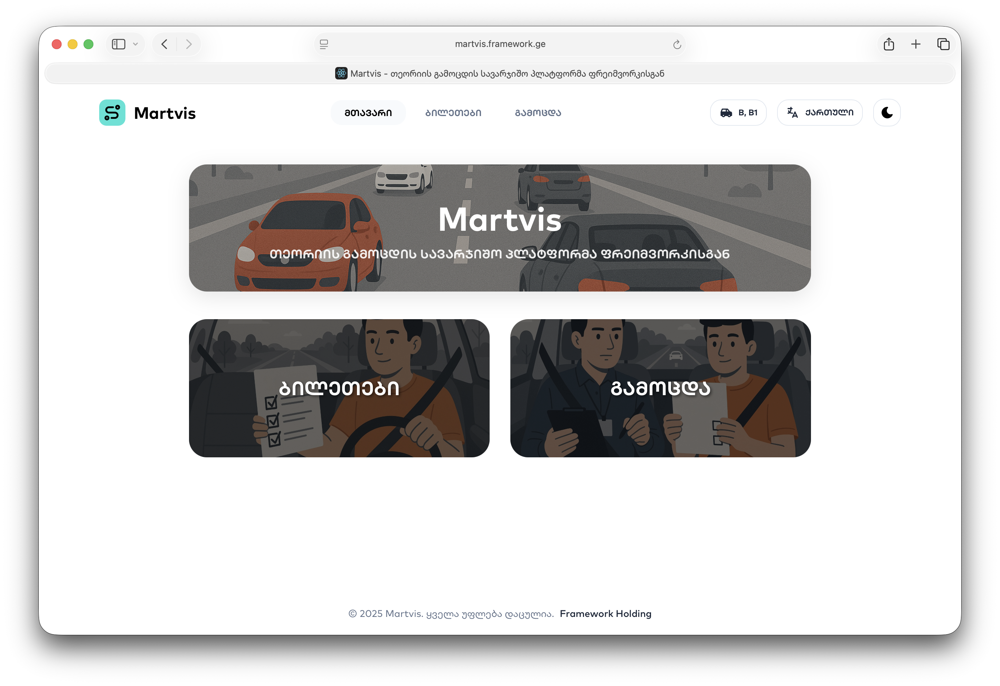
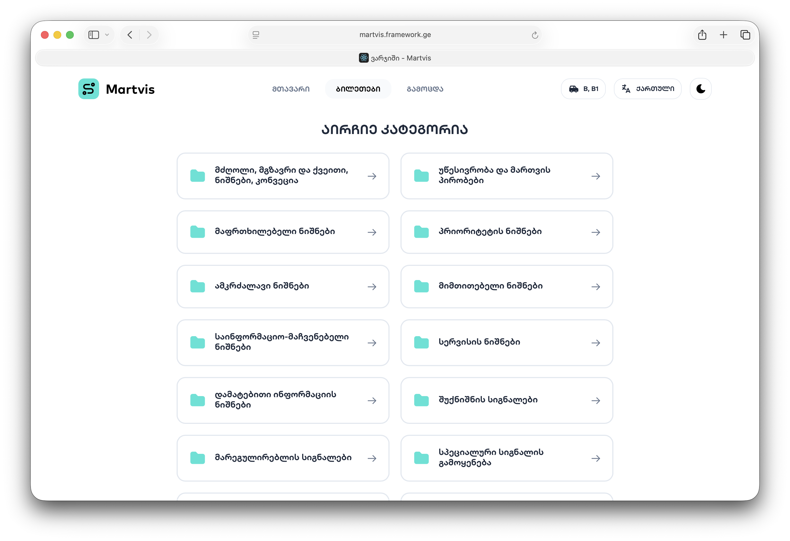
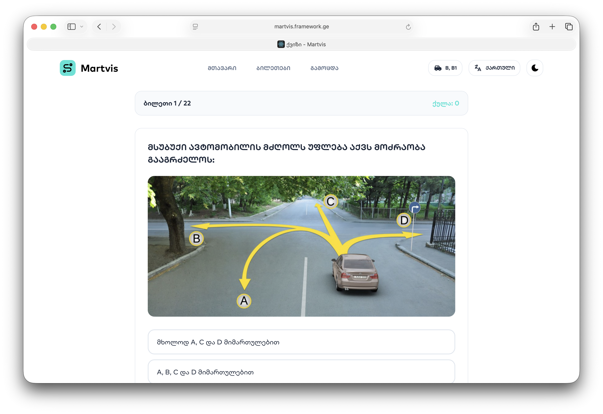
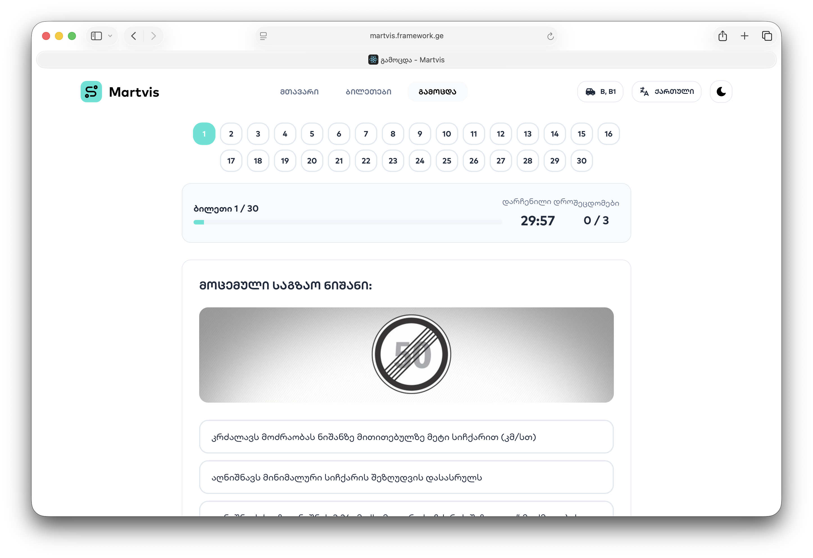
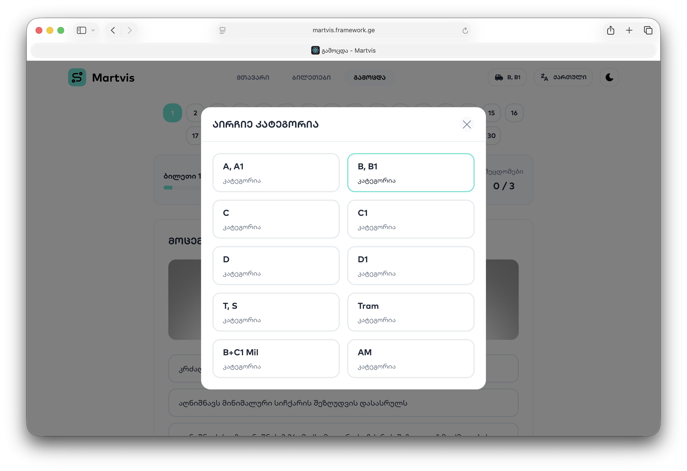
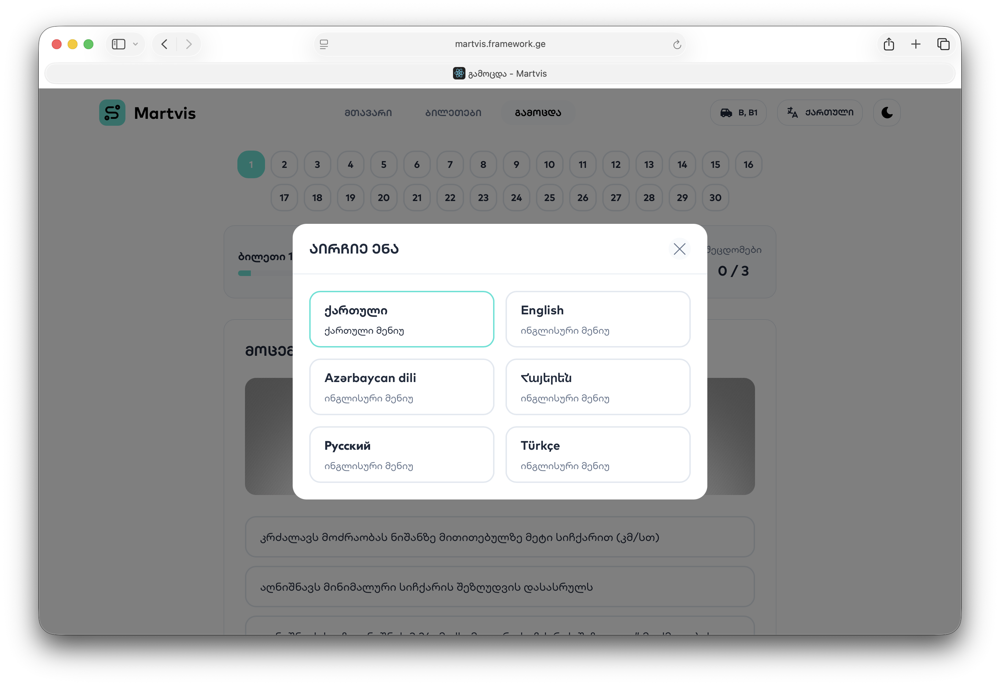

# Martvis React Project

This project was created for the BTU React exam. It's a comprehensive React application that demonstrates various React concepts and modern web development practices.



## 🚀 Technologies Used

### Core Technologies
- **React 19.1.0** - Modern React with latest features
- **React Router DOM 7.6.2** - Client-side routing
- **React DOM 19.1.0** - React rendering for web

### Styling & UI
- **Sass 1.89.2** - Advanced CSS preprocessor
- **SCSS** - Syntactically Awesome Style Sheets



### HTTP & API
- **Axios 1.10.0** - HTTP client for API requests
- **Framework LLC API** - Backend services provided by Framework LLC
  - Base URL: `https://api.framework.ge/martvis/api`
  - Endpoints for vehicles, categories, languages, tickets, and exams



### Development & Testing
- **React Scripts 5.0.1** - Create React App build tools
- **@testing-library/react 16.3.0** - React testing utilities
- **@testing-library/jest-dom 6.6.3** - Custom Jest matchers
- **@testing-library/user-event 13.5.0** - User event simulation
- **@testing-library/dom 10.4.0** - DOM testing utilities
- **Web Vitals 2.1.4** - Web performance metrics



### Project Structure
- **Context API** - State management with LanguageContext and ThemeContext
- **Custom Hooks** - Reusable logic (useApi, useFontLoader, useLocalStorage, usePageTitle)
- **Component Architecture** - Modular component structure
- **Service Layer** - API service abstraction



## 🔌 API Integration

This project integrates with **Framework LLC's API** (`https://api.framework.ge/martvis/api`) to provide:

- **Vehicle Data** - Information about different vehicle types
- **Categories** - Question categories for different topics
- **Languages** - Multi-language support
- **Tickets** - Practice questions and tickets
- **Exams** - Exam functionality and questions

The API service is implemented in `src/services/apiService.js` using Axios for HTTP requests with proper error handling and timeout configuration.



## 📁 Project Structure

```
martvis/
├── public/                 # Static assets
├── src/
│   ├── components/         # Reusable UI components
│   │   ├── BottomTabBar.js
│   │   ├── Footer.js
│   │   ├── Header.js
│   │   ├── LanguageModal.js
│   │   ├── Preloader.js
│   │   └── VehicleModal.js
│   ├── contexts/           # React Context providers
│   │   ├── LanguageContext.js
│   │   └── ThemeContext.js
│   ├── hooks/              # Custom React hooks
│   │   ├── useApi.js
│   │   ├── useFontLoader.js
│   │   ├── useLocalStorage.js
│   │   └── usePageTitle.js
│   ├── pages/              # Main application pages
│   │   ├── Home.js
│   │   ├── Practice.js
│   │   ├── Quiz.js
│   │   └── Exam.js
│   ├── services/           # API and external services
│   │   └── apiService.js
│   ├── styles/             # SCSS stylesheets
│   └── utils/              # Utility functions
├── package.json
└── README.md
```


## 🛠️ Setup Instructions

### Prerequisites
- **Node.js** (version 16 or higher)
- **npm** (comes with Node.js)

### Installation

1. **Clone the repository**
   ```bash
   git clone <repository-url>
   cd martvis
   ```

2. **Install dependencies**
   ```bash
   npm install
   ```

3. **Start the development server**
   ```bash
   npm start
   ```

   The application will open in your browser at `http://localhost:3000`

### Available Scripts

- **`npm start`** - Runs the app in development mode
- **`npm test`** - Launches the test runner
- **`npm run build`** - Builds the app for production
- **`npm run eject`** - Ejects from Create React App (one-way operation)

## 🎯 Features

- **Multi-language Support** - Internationalization with context
- **Theme Management** - Dark/light theme switching
- **Responsive Design** - Mobile-first approach
- **Custom Hooks** - Reusable logic patterns
- **API Integration** - External data fetching
- **Routing** - Client-side navigation
- **Testing Setup** - Comprehensive testing infrastructure

## 📱 Pages

- **Home** - Landing page
- **Practice** - Practice mode
- **Quiz** - Quiz functionality
- **Exam** - Exam mode

## 🔧 Development

This project demonstrates:
- Modern React patterns and best practices
- Context API for state management
- Custom hooks for reusable logic
- SCSS for advanced styling
- Component composition
- Service layer architecture
- Testing setup with React Testing Library

## 📝 Notes

This project was created as part of the BTU React exam requirements, showcasing proficiency in React development, modern JavaScript, and web development best practices.

## 🤝 Contributing

This is an exam project, but feel free to explore the code and learn from the implementation patterns used.

## 📄 License

This project is created for educational purposes as part of the BTU React exam. 
